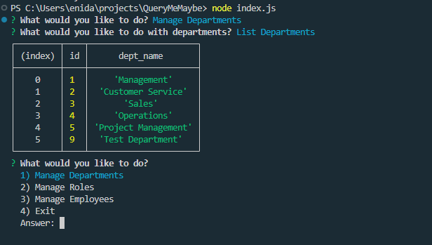
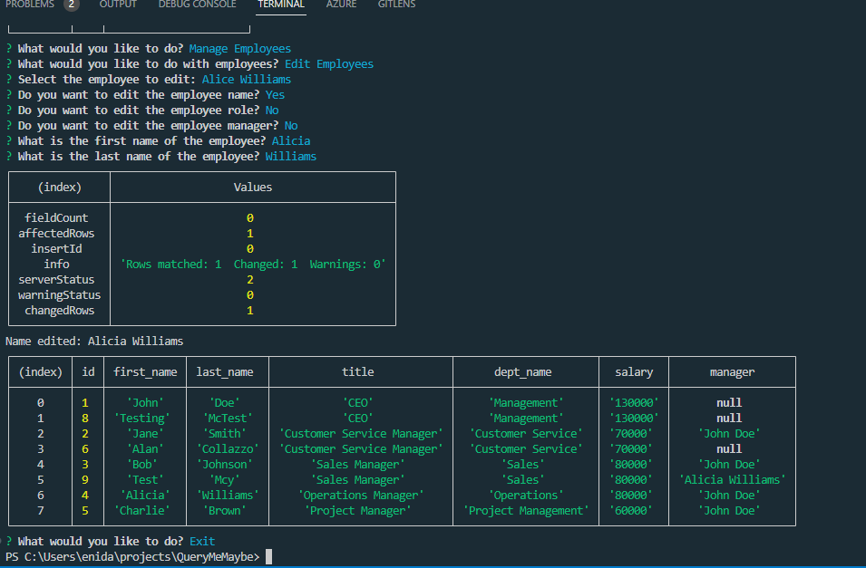

# QueryMeMaybe

## Description

Creating a command-line application that accepts user input allows me to understand how to handle and process user commands effectively. Additionally, I will learn how to interact with databases, retrieve and format data, and perform data manipulation tasks. This project enables me to explore various functionalities such as creating tables, inserting data, and updating records. Ultimately, building this application will enhance my overall understanding of the development process and equip me with valuable experience for future projects.

## Table of Contents

- [Installation](#installation)
- [Usage](#usage)
- [License](#license)
- [Credits](#credits)
- [Tests](#tests)
- [Contact](#contact)

## Installation

1. Install all the project dependencies.
2. Clone this repository git@github.com:justjenb/QueryMeMaybe.git.
3. Navigate to the directory containing index.js.
4. Run the script using node index.js from the terminal.
5. Answer the prompts.
6. Check your database queries for accuracy and any other edits.

## Usage

Manage Departments, Roles and Employees. Add/Remove/List/Update is available for each.

## License

**This project is licensed under the [MIT](https://opensource.org/licenses/MIT) license.**

For more information about this license, please visit the following link:

https://opensource.org/licenses/MIT

## Credits

References:

https://dev.to/nehasoni__/power-of-console-table-in-javascript-18n0

https://stackoverflow.com/questions/66626936/inquirer-js-populate-list-choices-from-sql-database

https://stackoverflow.com/questions/20238829/asynchronous-nodejs-module-exports

https://python-inquirer.readthedocs.io/en/latest/usage.html

https://www.npmjs.com/package/mysql2#using-promise-wrapper

https://github.com/jpd61/employee-tracker/blob/master/server.js

https://stackoverflow.com/questions/64220107/passing-sql-queries-into-inquirer-prompt

https://stackoverflow.com/questions/75420796/mysql-results-for-inquirer-prompt

https://stackoverflow.com/questions/70238296/trying-to-pass-variables-into-a-prepared-statement-in-javascript-node-js

https://gist.github.com/midnightcodr/bd8f9cd4414f5571774c141d1e0865d8

## Tests

Run tests with Jest using npm test.

## Contact

My name is Jen Butler.

Here is a link to my [GitHub](https://github.com/justjenb) profile. 

Additional contact details:

You can email me at jen@jenbutler.me
